# Substance to Maya
## version 0.1

This tool is used to automatically connect Substance Painter textures to Arnold, VRay and Renderman for Maya.

## Installation

* Put the SubstancePainterToMaya folder in a maya script directory (I.e: C:\Users\user\Documents\maya\scripts on Windows)    
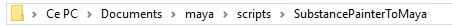  

* The content of the folder need to be this one  
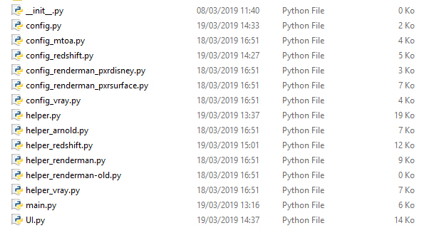  
 
* Create a shelf button in Maya with the following Python command  
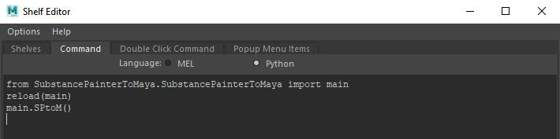  

## How to use
1. Open a scene
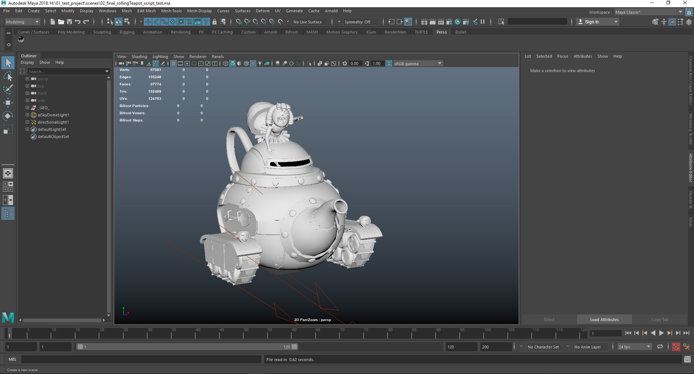  
2. Click on the shelf button to launch the tool  
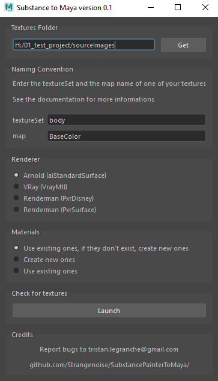  
3. Define the texture folder
4. Define the Naming Convention
5. Choose the renderer
6. Choose a materials option
7. Click on Launch  
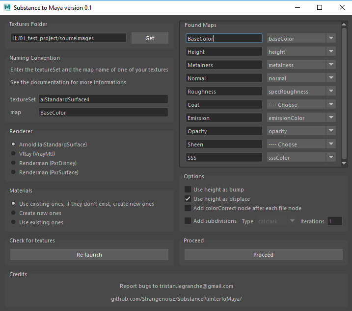  
8. Specify where to plug each found maps
9. Choose some options  
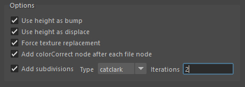  
10. Click on Proceed  
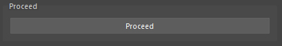  
11. Enjoy !  
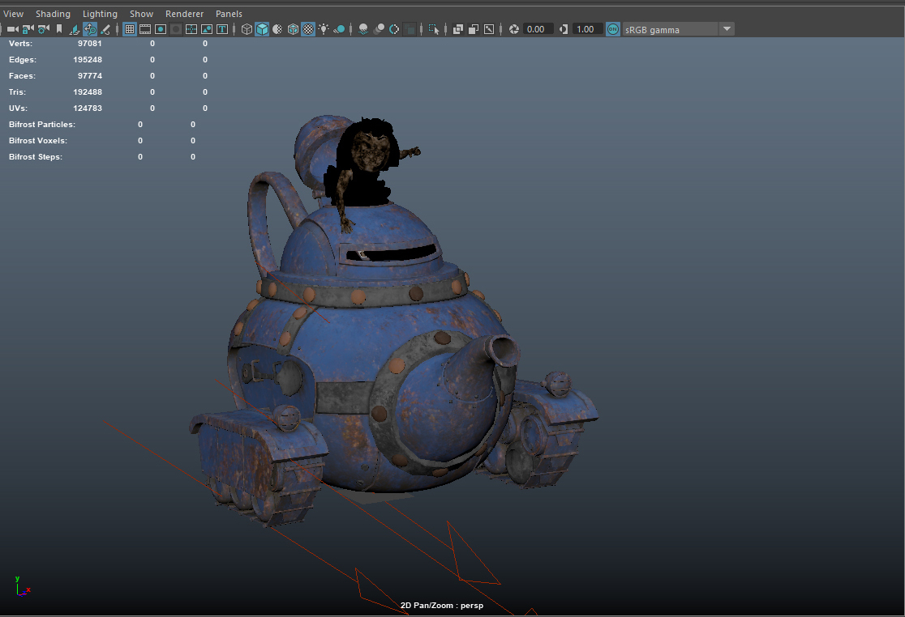  

## Features details

* #### Texture folder
Choose the folder that contains your Substance Painter textures  
Click **Get** to open a dialog to choose the folder or type the folder's path in the textfield  
By default, the tool uses the sourceImages folder of your project

* #### Naming convention
Use the same naming convention as your Painter map export.   
Use $map where you put your map's name (ex: diffuse)   
Tthe script needs $textureSet and $map to work.  
(I.e for a texture named rollingTeapot_aiStandardSurface1_BaseColor, the naming convention is $mesh_$textureSet_$map)  

Click the **Set button** and check the example bellow to see if it corresponds.  
Use whatever word you want for the other parts of your naming convention  
(I.e: 'mesh' is used by default to indicates that the textures files begin with a word)

* #### Renderer
Choose the renderer you want to use

* #### Materials
**Create new ones if they doesn't exist, instead use existing ones**  
If the tool find shaders named like your Naming Convention's $textureSet, and if the shaders are the ones used by your renderer, the textures will be plugged in those shaders, instead, the tool will create new shaders with the name and '_shd' as suffix. 
**Create new ones**  
The tool will create new shaders and plug the textures in them and add '_shd' suffix to the found name.  
**Use existing ones**  
If the tool find shaders named like your Naming Convention's $textureSet, and if the shaders are the ones used by your renderer, the textures will be plugged in those shaders, instead, nothing will append.

* #### Launch and Re-launch
Click this button to launch the search of the textures and the creation of the second part of the interface.  
Click the Re-launch button if you've changed the texture folder, the naming convention, the renderer, or after you've moved new textures in the Texture Folder and want to use that changes.

* #### Found Maps
Based on your Naming Convention, the tool will create lines  
On the left are the found names, and for each name, a dropdown menu is created on it's right to let you specify in which parameter you want to plug that map.   
The script automatically purpose parameters for usual maps (I.e: baseColor, BaseColor, albedo... are related to the baseColor parameter, but you can choose another one in the dropdown menu)   

* #### Options
**Use height as bump**  
If enabled, the height maps will be used as bump maps (if there's also a normalMap, both will be used in the bump parameter of the material)  
**Use height as displace**  
If enabled, the height maps will be used as displacement maps  
**Force texture replacement**  
If enabled, if the tool find a texture already connected to the needed parameter, it will break the connection and add the new texture instead   
**Add colorCorrect node after each file node**  
If enabled, the tool will add a colorCorrect node after each file node, before the connection to a utility or the material  
**Add subdivisions**  
If enabled, you can choose the type and the number of iterations you want  
For each model connected to an already existing shader used by the tool, render subdivisions will be added.

* #### Proceed
Click this button to import the textures, create the nodes and connect everything

## Step by step with Arnold 
#### (Vray is pretty much the same)
1 - A scene is opened  

  
2 - With existing materials

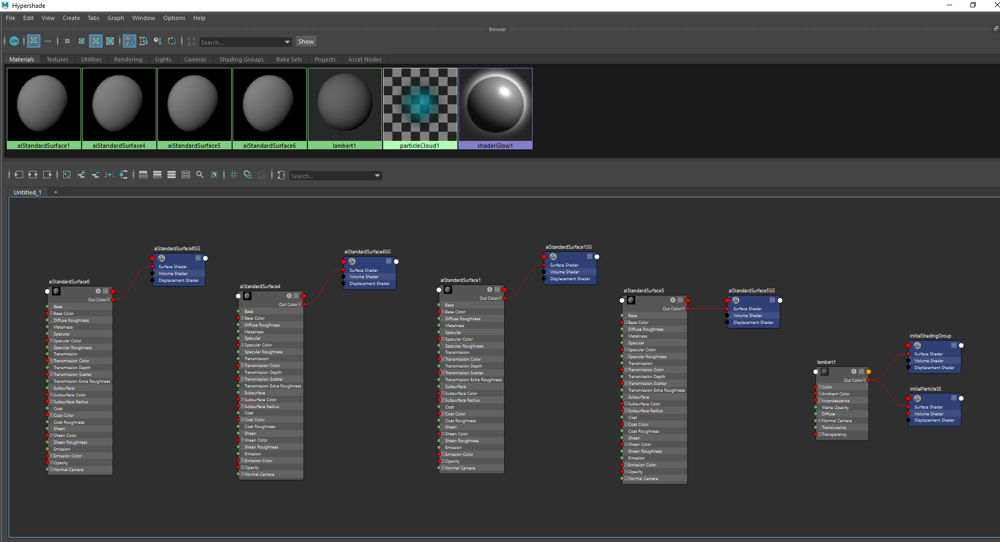  

3 - I launch the tool
  
  

4 - I use the predefined texture folder (project/sourceImages) in my case, use **Get** to use another one
  
  

5 - I let the naming convention by default because my texture files are matching it (mesh_textureSet_map.png)
  
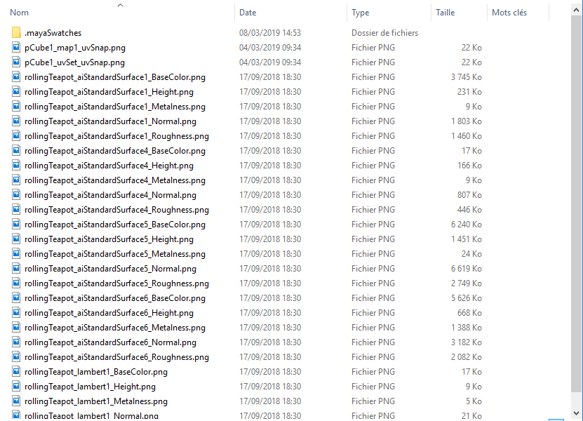  

6 - I click on launch to search for the textures.  
You can now see the list of the found maps, for each map you can specify in which aiStandardSurface parameter you want to plug it.  
See that a uvSnap and UVSnapshot000 have been found, I let the dropdown menu on ---- Choose so they will not be used  
For more usual maps, the parameters are already set (but you can change them if you want)
    
  

7 - I set the options (all in this case, so I will use height in bug and displace, force the texture replacement, add a colorCorrect after each file node and add subdivisions to the models)
    
  

8 - I click on proceed to launch the procedure
  
  

9 - Here is the result, textures are applied
  
  

10 - In the Hypershade I can see all the new nodes
  
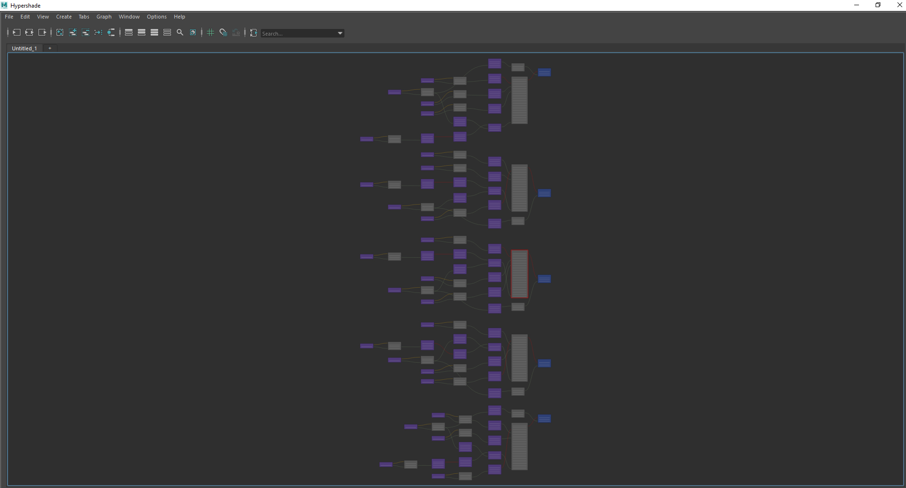  

11 - A material in details, with the colorCorrects, the connection for bump and normalMap, the displacement
  
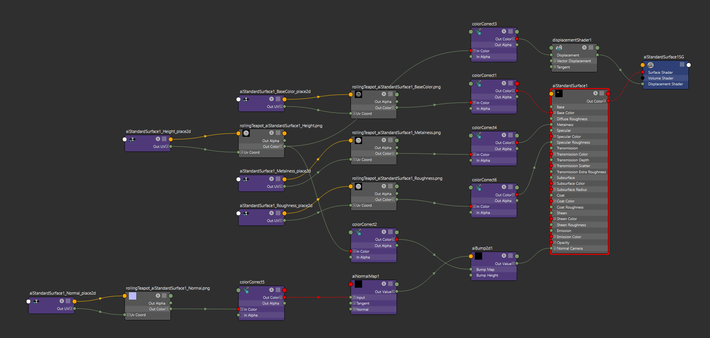  

12 - A created material, Lambert1 was defined as a name in my textureSets (see the texture folder content), because Lambert1 isn't an aiStandardShader, a new one is created with the name Lambert1_shd
  
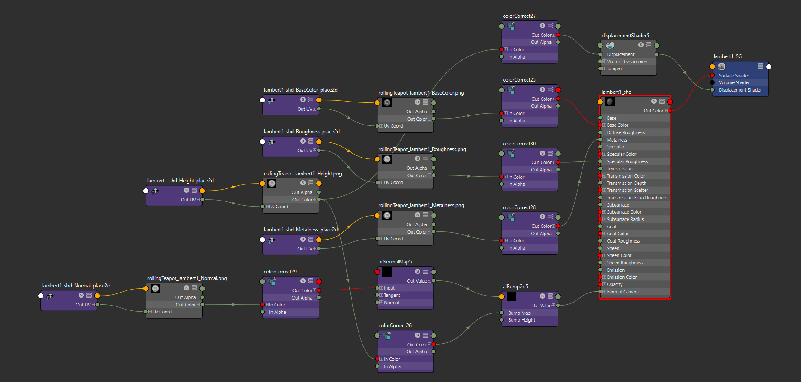  

13 - The models with already existing materials now have the subdivisions specified in the options
  
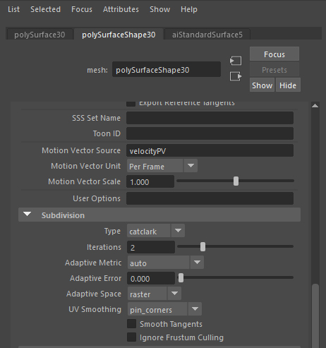  

14 - The wireframe render (subdivisions power !)
  
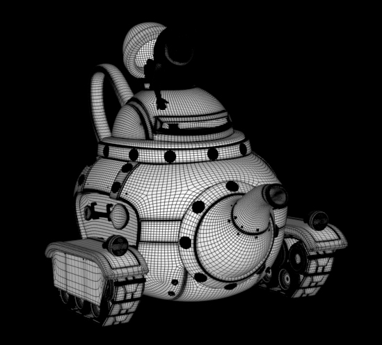  

15 - And the final result (quickly made for this documentation)
  
  

## Limitations

1. This version 0.1 only works with Arnold and Vray

## Features to come

1. Usable with Renderman
2. Choose the shader to use (I.e: aiStandardHair, aiStandardVolume...)
3. Add UDIMs option
4. Don't create nodes if they're not needed

## Credits

Created by Tristan Le Granche  
Licence CC-BY-NC  

Bugs report and ask for commercial use to tristan.legranche@gmail.com