# Substance to Maya
## version 0.1
## Arnold exemple

[Go back to documentation](README.md)

1 - A scene is opened

2 - With existing materials

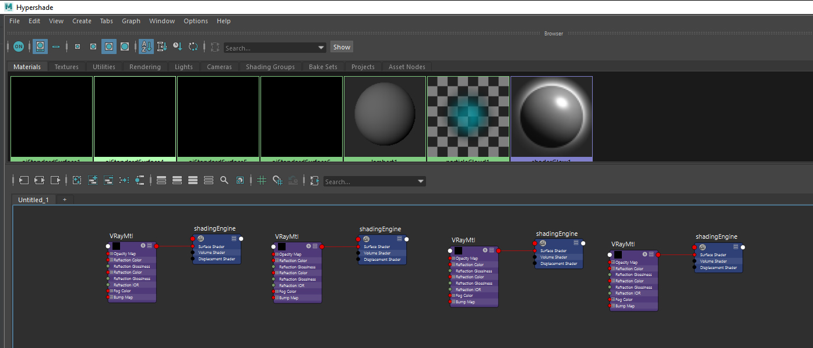

3 - I launch the tool

4 - I use the predefined texture folder (project/sourceImages) in my case, use **Get** to use another one

Here's the content of my folder

5 - I enter the textureSet and the map of one of my textures in the Naming Convention part

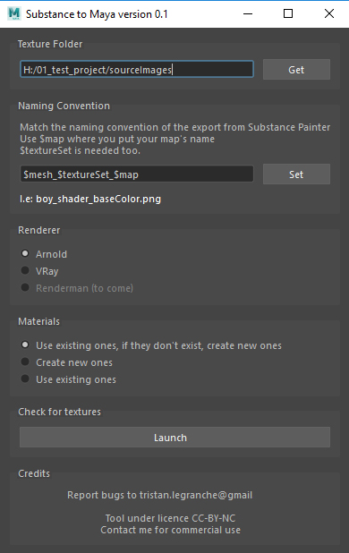

6 - I choose my render engine

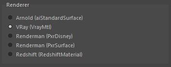

7 - I choose to create new materials if there's no existing one

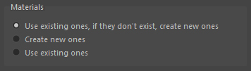

8 - I click on launch to search for the textures.

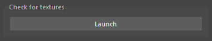

You can now see the list of the found maps, for each map you can specify in which VRayMtl parameter you want to plug it.  
See that a Coat, Sheen and Emission have been found, let ---- Choose so they will not be used, or choose another parameter.      
For more usual maps, the parameters are already set (but you can change them if you want)  
As I usually work with Arnold, I created Metalness and Roughness, used as Reflection and Glossiness.  
    
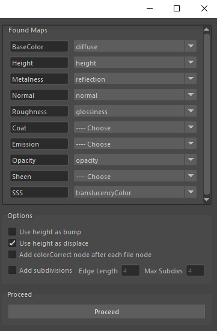  

9 - I set the options (all in this case, so I will use height in bump and displace, force the texture replacement, add a colorCorrect after each file node and add subdivisions to the models)
    
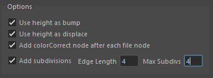  

10 - I click on proceed to launch the procedure
  
  

11 - Here is the result, textures are applied
  
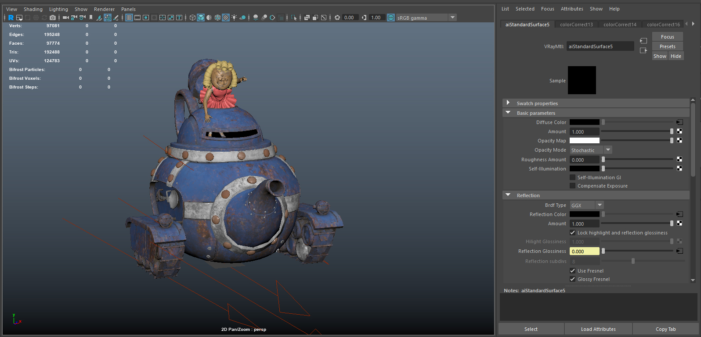  

12 - In the Hypershade I can see all the new nodes
  
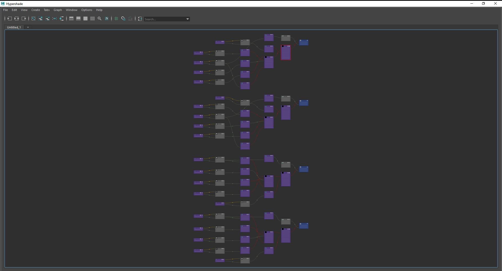  

13 - A material in details, with the colorCorrects, the connection for bump and normalMap, the displacement
  
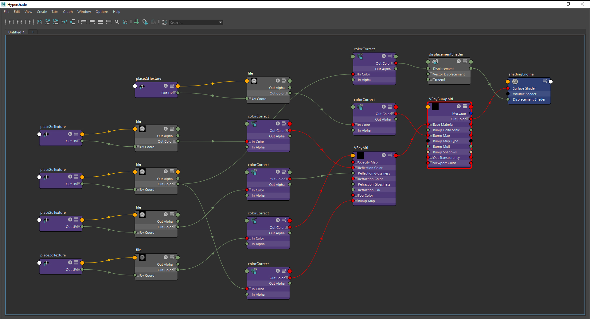  

14 - A created material, Lambert1 was defined as a name in my textureSets (see the texture folder content), because Lambert1 isn't an VRayMtl, because Lambert1 doesn't exist a new material Lambert1_shd has been created
  
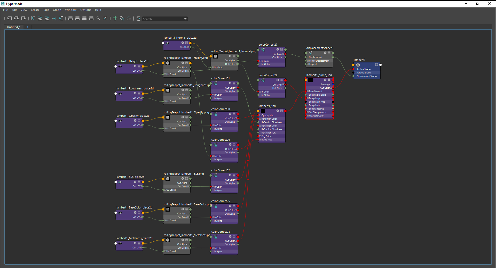  

15 - The models with already existing materials now have the subdivisions specified in the options
  
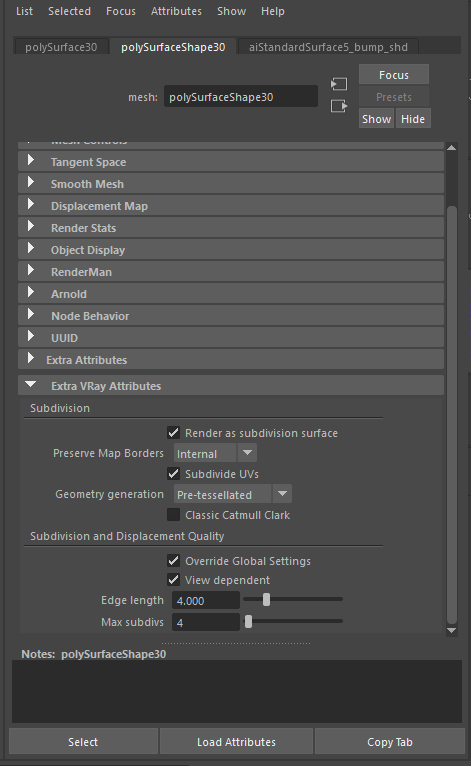  

[Go back to documentation](README.md)
