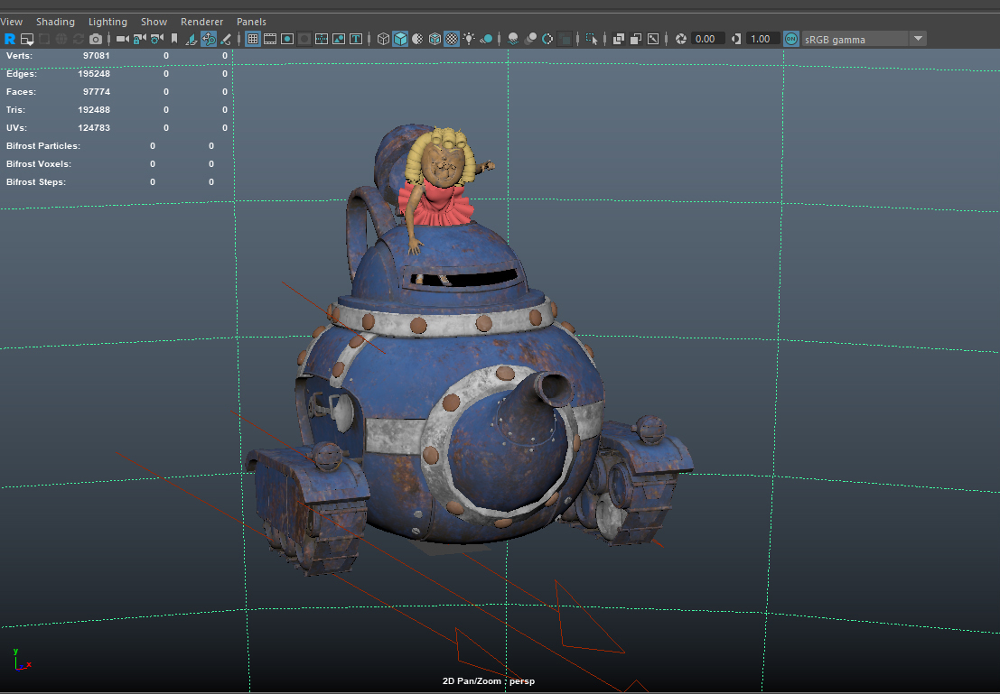
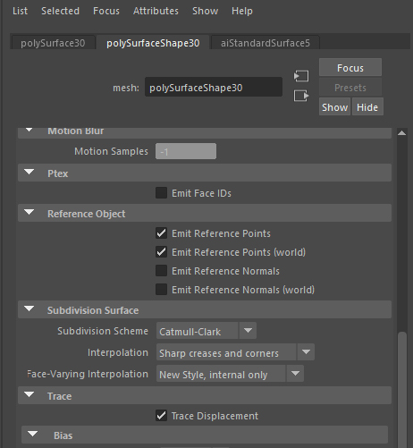

# Substance to Maya
## version 0.1
## Renderman PxrSurface example

[Go back to documentation](README.md)

1 - A scene is opened

2 - With existing materials

3 - I launch the tool

4 - I use the predefined texture folder (project/sourceImages) in my case, use **Get** to use another one

5 - I let the naming convention by default because my texture files are matching it (mesh_textureSet_map.png)

6 - I click on launch to search for the textures.
You can now see the list of the found maps, for each map you can specify in which PxrSurface parameter you want to plug it.
See that a Sheen, Coat and Emission have been found, let ---- Choose so they will not be used, or choose another parameter.
For more usual maps, the parameters are already set (but you can change them if you want)  
As I usually work with Arnold, I created Metalness and Roughness, they are automatically used as specularFaceColor and specularRoughness.  

7 - I set the options (all in this case, so I will use height in bump and displace, add a colorCorrect after each file node and add subdivisions to the models)

8 - I click on proceed to launch the procedure

9 - Here is the result, textures are applied

If you've not added colorCorrect nodes here the result

Else, Maya's viewport can't handle pxrColorCorrect nodes so the result is black in the viewport

10 - In the Hypershade I can see all the new nodes

11 - A material in details, with the colorCorrects, the connection for bump and normalMap, the displacement

12 - A created material, Lambert1 was defined as a name in my textureSets (see the texture folder content), because Lambert1 isn't an aiStandardShader, a new one is created with the name Lambert1_shd

13 - The models with already existing materials now have the subdivisions specified in the options

[Go back to documentation](README.md)
